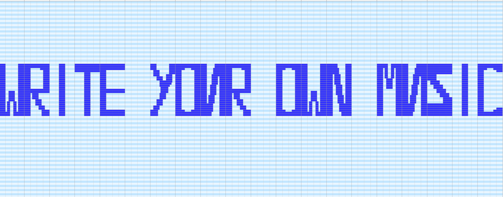

## Problem
Our musician friend Martin recently bought a melody pack containing different melodies recorded in MIDI format. He hoped to use them in his electronic music tracks and then pretend that he was the person who actually wrote them. He spent a solid hundred dollars, but the website selling sample packs fooled him! Instead of 10 wonderful melodies, he only received one MIDI file. It sounded awful, and Martin quickly noticed why!

Can you notice why?

See for yourself: [melody.mid](melody.4f1964921e6a.mid)
## Hint
How would you edit MIDI?
## Writeup
Use any tool to open the MIDI file (I used [MidiEditor](http://midieditor.sourceforge.net/index.php?category=intro)). We are greeted with this:

The flag is "WRITE YOUR OWN MUSIC".
